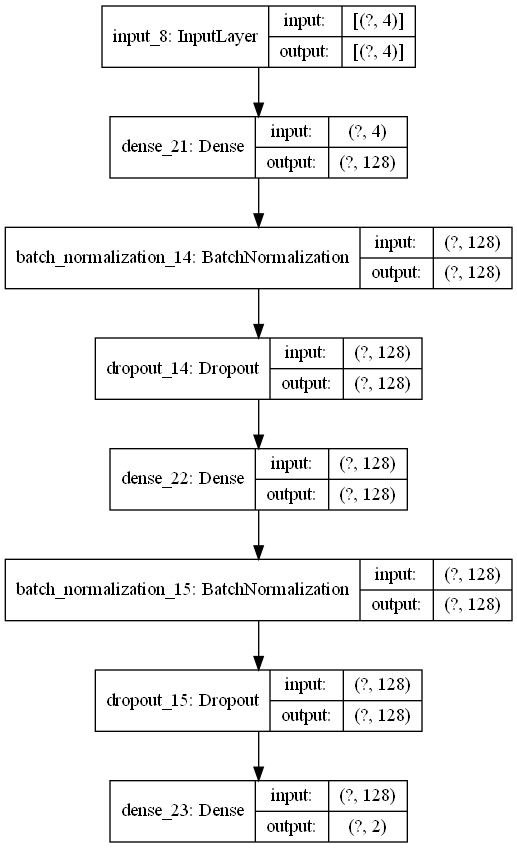
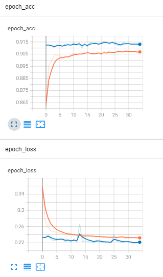
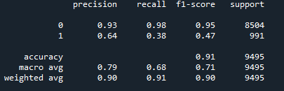
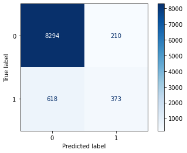

# Sequential Deep Learning Model - Customer Segmentation

The aim of this project is to design a deep learning model to accurately predict whether a customer will subscribe to the focus product of a marketing campaign.
The dataset used contains details of marketing campaigns done via phone with various details for customers such as demographics, last campaign details etc. 

## Prerequisites

This script uses the following python libraries:
1. Pandas
2. Numpy
3. SciPy
4. Scikit-Learn
5. TensorFlow
6. MatPlotLib
7. Seaborn

## Model Architecture
The following figure shows the default model architecture used in the script.

## Results

As the model trains, the loss and accuracy metrics are displayed using TensorBoard. This model reaches an accuracy of about 0.9 (or 90%) on the training data.

The following figures display how the model performs on the test dataset:

Category 1 has a low f1-score of 0.47. This is likely due to the imbalance between the counts of Category 0 and 1 in the original dataset, which is 28253(89%) & 3394(11%) respectively. Imputational methods such as SMOTE might be beneficial to improve the performance of the model.

## Credits

Data : [HackerEarth HackLive: Customer Segmentation](https://www.kaggle.com/datasets/kunalgupta2616/hackerearth-customer-segmentation-hackathon)

Special acknowledgement: Warren Loo & DS03

## References
1. [Chapter 8: Sequence Models; The Mathematical Engineering of Deep Learning](https://deeplearningmath.org/sequence-models.html)

2. [Classification: Precision and Recall; Google Machine Learning Crash Course](https://developers.google.com/machine-learning/crash-course/classification/precision-and-recall)

3. [Analyzing machine learning model performance; IBM Knowledge Studio](https://cloud.ibm.com/docs/watson-knowledge-studio?topic=watson-knowledge-studio-evaluate-ml#evaluate-mllowr)
